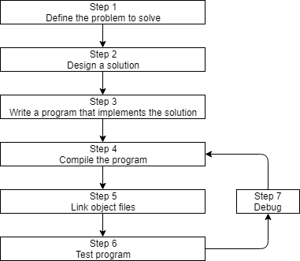
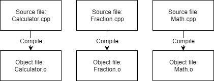

[TOC]

# #1 Compiler,Linker和Libraries

CPP软件设计流程如下图所示：  

编译器、链接器、库这三个工具主要发生在4～7这几个步骤中。  

## 编译器 Compiler

当你的代码源文件(.cpp)编写完毕后，电脑还无法识别，需要工具将人类可读的源代码转换为机器可读的机器码，这个工具就是编译器。  

当使用编译器编译C++程序时，编辑器会遍历每个源码文件，做以下两个重要的事情：  

- 语法检测：若检测到有语法错误或者不合理的地方，会给用户一个错误，并提示错误可能发生的地方
- 将源码转换为称作对象文件的面向机器语言的文件——`Object File`： 对象文件通常以`.o`或者`.obj`作为后缀，并与源码文件同名

如下图所示，若你有三个.cpp源码文件，编译器会生成三个对应的.o文件：  

## 库文件 Libraries

库文件，是指一系列预编译过的，给其他程序重用的打包好的代码。避免重复造轮子。  

C++的核心语言是非常精简的，但是C++还附带了一个庞大的，称作C++标准库(`C ++ Standard Library`)的扩展库。扩展库提供了很多额外的功能，然你能直接使用它们。例如，`iostream`库是常用的标准库之一，它提供了打印字符、获取用户输入等功能。  

## 链接器 Linker

在编译器生成一个或多个对象文件后，接下来，名为链接器的工具就会参与进来，做以下三个重要工作：  

- 将所有分散的对象文件结合为一个可执行的程序

- 除了链接用户自己的对象文件，链接器还能链接库文件

- 确保正确地解决所有跨文件依赖，例如一个文件引入了另一个文件，链接器就会将它们链接在一起，若无法链接，则会报错

> 进阶阅读
>
> 对于复杂的工程，开发环境常使用`makefile`文件，该文件描述了如何去构建当前程序。由于makefile不是C++核心语言的部分，因此该笔记不会涉及。

