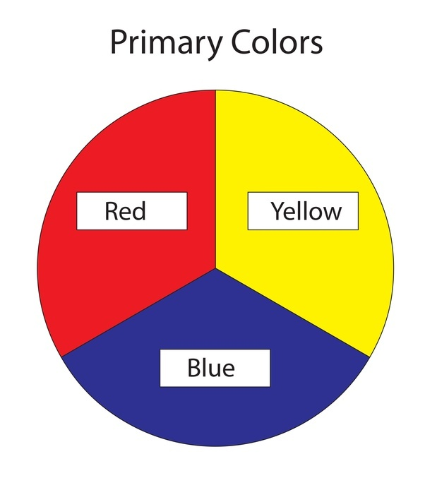
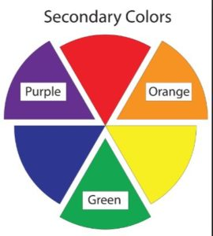
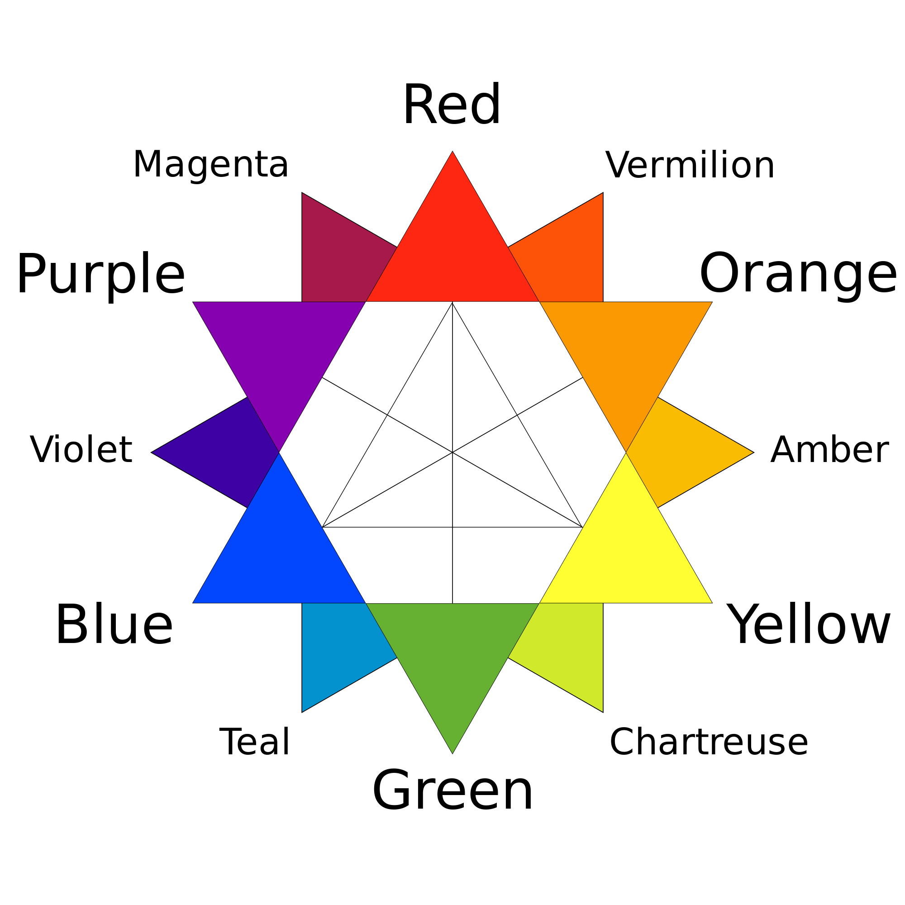
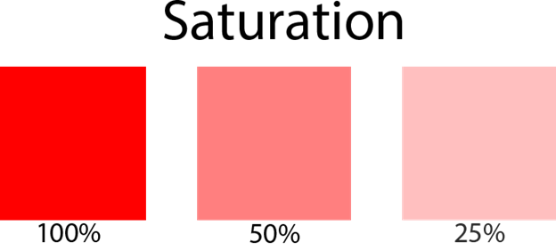
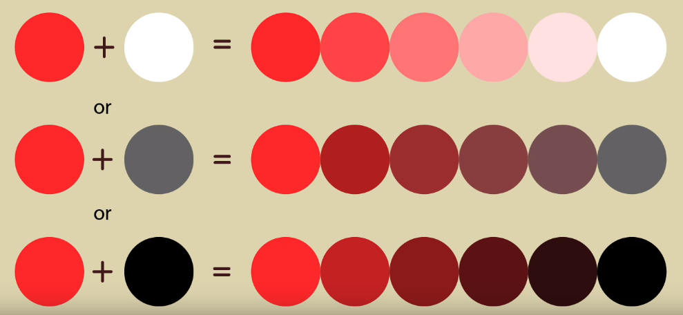

# Color Theory 色彩理论

> 以下内容尽量记英文。

## 中英名词对照

- Hue 色相

- Tint 色彩

- Shade 色度，绘影

- Tone 色调

- Primary Color 三原色

- Secondary Color 三间色

- Tertiary Color 三次色

- Saturation 饱和度

- High Saturation 高饱和度

- Desaturation 低饱和度

- Llightness 亮度

- Darkness 暗度

- Value 明度

## Color Mixing 调色

### Primary Color 三原色

红、黄、蓝。  

  

  

### Secondary Color 三间色

也叫二次色，橙、绿、紫。  

  

  

### Tertiary Color 三次色

即复色，三原色按不同比例可得多种复色。  

红紫、红橙、黄橙、黄绿、蓝绿、蓝紫。  

  

  

### Saturation 饱和度

> Saturation is the intensity or purity of a hue.
>
> Saturation is a measure of how "much" of the hue exists in the color-it's intensity. Think of what happens to colors at sunset. The purer the color, the more highly saturated it is.

一个颜色的强度或者纯度。越高颜色越纯。  

饱和度越低，颜色越发变灰，为0时，为白色。

  

  

### Hue 色相

> Hue (sometimes called "local color") is generally what we mean when we ask, "What color is it?"- the car is blue, the apple is red.

通常是 `颜色的名字` ，是饱和度和亮度都为100%的颜色。所有的色相可以用色相环来展示。  

  

### Tint 色彩

> A hue produced by adding white.

是 `色相` 与 `白色` 组合产生的颜色。Hue通过加入不同比例的白色，可以产生一系列的Tints。最终颜色是白色。  

  

### Shade 色度

> A hue produced by adding black.

是 `色相` 与 `黑色` 组合后产生的颜色。Hue通过加入不同比例的黑色，可以产生一系列Sahde绘影。最终颜色是黑色。  

  

### Tone 色调

> A hue produced by adding grey.

是色相和灰色组合产生的颜色。Hue通过加入不同比例的黑色和白色，可以产生一系列的Tone。最终颜色是灰色。  

### Value 明度

> value, is a measure of the lightness or darkness of a color.
>
>  Think of a tree with some of its leaves in bright light and some in shadow.

明度是指颜色的亮暗。  

## Color Scheme 配色

### Monochromatic Scheme 单色方案

只使用一种hue，然后与白色、黑色、灰色组合，创造tints，tones和shades。  

  

### Complementary Color Scheme 互补色方案

使用色轮上彼此相对的颜色，最普遍的配对方式是：红色-绿色，黄色-紫色和橘色-蓝色。  

### Analogous Color Scheme 相似色方案

在色轮上，选择2~4个相邻的颜色。  

### Triadic Color Scheme 三元配色方案

在色轮上，选择3种均匀分布在色轮周围的颜色。  

### Split-Complementary Color Scheme 拆分互补配色方案

在色轮上先选择一个颜色，然后再选择它互补色的左右两侧的两种颜色。  

### Tetradic(Rectangle) Color Scheme 矩形配色方案

在色轮上选择4种颜色，由组成矩形的两对互补色构成。  

### Square Color Scheme 方形配色方案

在色轮上选择4种颜色，由组成方形的两对互补色构成。  

