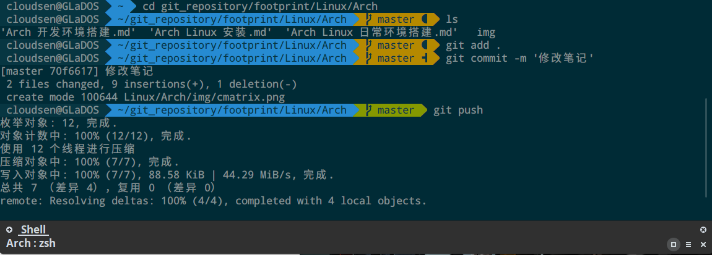
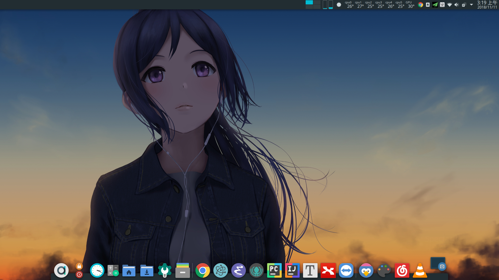
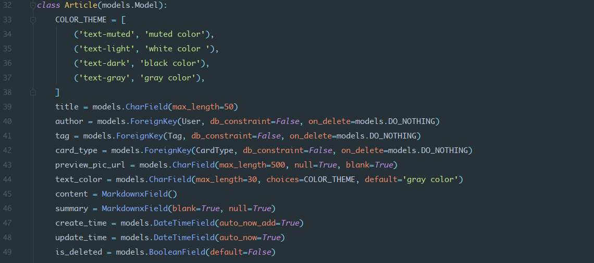

# Arch Linux 日常环境搭建  


## ZSH

大名鼎鼎的 `ZSH` 就不解释了。主要是安装后面的 `oh-my-zsh`

```bash
sudo pacman -S zsh
# 查看zsh是否安装完毕
zsh --version
# 将bash切换为zsh
# 可以直接编辑passwd文件
sudo vim /etc/passwd
# 也可以这样
sudo chsh -s $(which zsh)
```

  

## robbyrussell/oh-my-zsh

`oh-my-zsh` 是用来管理 `zsh` 配置的框架，`zsh` 的默认配置及其复杂繁琐，而 `oh-my-zsh` 让 `zsh` 配置降到0门槛。而且它完全兼容 `bash`，并且提供了很多使用的插件和美观的主题。  

### 安装

```bash
sh -c "$(curl -fsSL https://raw.github.com/robbyrussell/oh-my-zsh/master/tools/install.sh)"
```

  

安装完毕后，在 `~` 目录生成新的 `.zshrc` 配置文件。  

若有乱码，则安装powerline字体库：

```bash
cd ~/Downloads/
git clone https://github.com/powerline/fonts.git --depth=1
cd fonts/
./install.sh
cd ..
rm -rf fonts
```

### 插件与主题

官方自带插件存放在：`~/.oh-my-zsh/plugins/  `

第三方插件存放在：`~/.oh-my-zsh/custom/plugins/`  

官方自带主题存放在：`~/.oh-my-zsh/themes/`  

第三方主题存放在:  `~/.oh-my-zsh/custom/themes/`  

### 配置

修改 `.zshrc` ，加入以下内容，还有很多插件后期再介绍：  

```bash
# 修改主题
ZSH_THEME="agnoster"

# easy aliases
alias zshconfig="mate ~/.zshrc"
alias ohmyzsh="mate ~/.oh-my-zsh"
alias getip="curl -i http://ip.cn"

# Ibus
export GTK_IM_MODULE=ibus
export XMODIFIERS=@im=ibus
export QT_IM_MODULE=ibus

# Terminal Proxy
alias setproxy="export ALL_PROXY=socks5://127.0.0.1:1080"
alias unsetproxy="unset ALL_PROXY"

# Python virtualenv wrapper
export WORKON_HOME=$HOME/work/python/virtual_env
export PROJECT_HOME=$HOME/work/python/projects
source /usr/bin/virtualenvwrapper.sh

```

  

  

## Yakuake

下拉式终端模拟，嗯，very nice。默认 `F12` 弹出下拉框。

```bash
pacman -S yakuake
```

  

  点击这里下载[Yakuake-Material主题](https://store.kde.org/p/1229144/)，下载完毕后，进入Yakuake `Configure Yakuake->Appearance` 安装主题。

## Xmind 8

> Xmind是java开发的，必须安装Java环境。见 [Arch Linux 开发环境配置]()。
>
> emmm。。。。不知道为什么，Ubuntu上能打开文件名有中文的文件，Arch上就只能打开纯英文命名的文件。。。
>
> 请支持正版软件，学生购买有很大优惠，就一份steam游戏的钱。

画思维导图必备。  

直接从官网下载 `.zip` 压缩包，解压到指定目录，然后执行 `/<解压路径>/xmind-8-update8-linux/XMind_amd64` 下面的XMind就可以运行了：  

```bash
cd ~/soft/xmind-8-update8-linux/XMind_amd64
./XMind
```

注意！这里有个大坑！JDK8以上打开时报错，配置 `XMind_amd64/XMind.ini` ，在末尾追加以下内容：

```text
--add-modules=ALL-SYSTEM
--illegal-access=warn
```

一定要注意！若系统默认java环境是JDK9，则会抛出ClassNotFoundException，换成JDK8或者修改 `XMind.ini` 就没报错，大概日志如下：  

```java
...
Caused by: java.lang.NoClassDefFoundError: javax/annotation/PostConstruct
	at org.eclipse.e4.core.internal.di.InjectorImpl.inject(InjectorImpl.java:151)
	at org.eclipse.e4.core.internal.di.InjectorImpl.internalMake(InjectorImpl.java:375)
	... 23 more
Caused by: java.lang.ClassNotFoundException: javax.annotation.PostConstruct cannot be found by org.eclipse.e4.core.di_1.6.0.v20160319-0612
	at org.eclipse.osgi.internal.loader.BundleLoader.findClassInternal(BundleLoader.java:398)
	at org.eclipse.osgi.internal.loader.BundleLoader.findClass(BundleLoader.java:361)
	at org.eclipse.osgi.internal.loader.BundleLoader.findClass(BundleLoader.java:353)
	at org.eclipse.osgi.internal.loader.ModuleClassLoader.loadClass(ModuleClassLoader.java:161)
	at java.base/java.lang.ClassLoader.loadClass(ClassLoader.java:496)
	... 25 more
	...
```

新建 `.desktop` 文件，写入以下内容，就能创建快捷方式：

```bash
[Desktop Entry]
Encoding=UTF-8
Name=XMind
Comment=xmind update 8
Exec=/home/cloudsen/soft/xmind-8-update8-linux/xmind.sh
Icon=/home/cloudsen/soft/xmind-8-update8-linux/XMind_icon.png
Terminal=false
StartupNotify=true
Type=Application
Categories=Application;Development;
```

新建启动脚本 `vim ~/soft/xmind-8-update8-linux/xmind.sh` 写入以下内容：

```bash
#!/bin/bash
cd /home/cloudsen/soft/xmind-8-update8-linux/XMind_amd64/
/home/cloudsen/soft/xmind-8-update8-linux/XMind_amd64/XMind
```


## yay

> Yet Another Yogurt - An AUR Helper Written in Go

`yaourt` 已经停更了， [yay](https://github.com/Jguer/yay) 是一款非常不错的AUR安装神器，使用 `GO` 语言编写而成，相当于将 `pacman` 进行了二次包装。  

### 安装

```bash
git clone https://aur.archlinux.org/yay.git
cd yay
makepkg -si
```

### 使用

1. 替代 `pacman` 少打几个字母：

   ```bash
   yay -S <包名>
   # 等同于
   pacman -S <包名>
   ```

2. 搜索包，并选择性安装：

   ```bash
   yay <包名>
   ```

     

3. 打印系统状态：

   ```bash
   yay -Ps
   ```

     

4. 清除不需要的依赖包：

   ```bash
   yay -Yc
   ```

     

5. 检查并更新系统和安装的软件：

   ```bash
   yay -Syu
   ```

     

  

## Typora

  

MarkDown编辑神器，所见即所得。

```bash
yay -S typora
```

  

## 网易云音乐

```bash
# 官方的
yay -S netease-cloud-music
# 可以搜索一下AUR库，有electron版本和终端版的
yay netease-cloud-music
```

  

## 系统代理

### ShadowSocksR

> 你懂的socks5代理，推荐使用跨平台的electron-ssr，图形界面和订阅很方便。

```bash
yay electron-ssr
```

  

### 终端使用代理

编辑 `~/.zshrc` ，加入以下 `alias` ：

```text
alias getip="curl -i http://ip.cn"
alias setproxy="export ALL_PROXY=socks5://127.0.0.1:1080"
alias unsetproxy="unset ALL_PROXY"
```

然后更新设置：

```bash
source ~/.zshrc
```

需要代理的时候就 `setproxy` ，不需要的时候 `unsetproxy` ，查看当前ip地址 `getip` 。

### 浏览器使用代理

见下方的 `Google Chrome` 。  

### KDE桌面代理

`System Settings` > NetWork中的`Settings` > `Proxy` > `Use manually specified proxy configurations` > 'SockS Proxy' 设置为 `127.0.0.1` ，端口 `1080`


## Google Chrome

### 安装

Chrome有三个版本 `Beta` `Dev` `Stable` ，看自己喜好下载。  

```bash
yay google-chrome
```

### 使用

#### 以代理方式启动

> 用于首次帐号登录，同步书签和扩展插件
>
> 确保代理已启动！

```bash
google-chrome-stable --proxy-server="socks5://127.0.0.1:1080"
```

#### 使用SwitchyOmega插件


首先设置自己的本地代理端口如图：

  

然后配置 `auto switch`，注意图中红色部分，将GFWLIST填入：  

```text
https://raw.githubusercontent.com/gfwlist/gfwlist/master/gfwlist.txt
```


  

配置好后，该插件会根据规则自动选择使用代理还是直连。  

如果遇到规则里面没有，且打不开的情况，就手动将该网站加入规则中：

选择 `add condition`    

  

    


## axel

多线程下载神器，`pacman` 和 `yay` 默认都是单线程下载的，通过 `axel` 实现多线程下载。  

```bash
yay axel
```

配置 `pacman.conf` ：  

```bash
sudo vim /etc/pacman.conf
    # 配置 XferCommand
    XferCommand = /usr/bin/axel -a -n 16 %u -o %o
sudo pacman -Syyu
```

配置 `makepkg.conf` ，让AUR资源使用多线程：

```bash
sudo vim /etc/makepkg.conf
	# 将http::/usr/bin/curl改为下面这行
	'http::/usr/bin/axel -a -n 16 %u -o %o'
yay -Syyu
```

  

## cmatrix

大概就是Hacker Hacker，牛叉感十足。  

  


## 字体

> 更多Linux字体美化见[Linux下终极字体配置方案](https://ohmyarch.github.io/2017/01/15/Linux%E4%B8%8B%E7%BB%88%E6%9E%81%E5%AD%97%E4%BD%93%E9%85%8D%E7%BD%AE%E6%96%B9%E6%A1%88/)

```bash
# 思源黑体 Noto Sans CJK TC ，TC是T Chinese
yay -S ttf-noto
# 文泉微米黑
yay -S wqy-microhei
# Android 之前用过的
yay -S ttf-droid
# Apple 的字体
yay -S ttf-monaco
```

终端我用的Noto Sans Mono for Powerline 或者 Droid Sans Mono for Powerline。

  

chrome我设置的Noto Sans CJK TC。  

  

    

编程字体 `monaco`：  

  


## Win10&Linux双系统，系统时间问题

WIN10和Linux系统同时安装后，会发现WIN的时间比实际时间早了8小时。  
在WINDOWS中管理员方式运行 `PowerShell` ,键入以下内容后 `重启` ，即可修复：  
```bash
Reg add HKLM\SYSTEM\CurrentControlSet\Control\TimeZoneInformation /v RealTimeIsUniversal /t REG_DWORD /d 1
```
