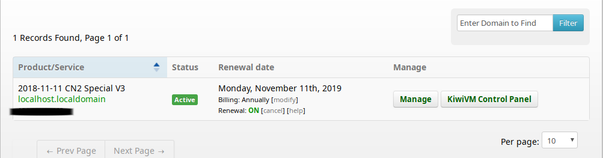
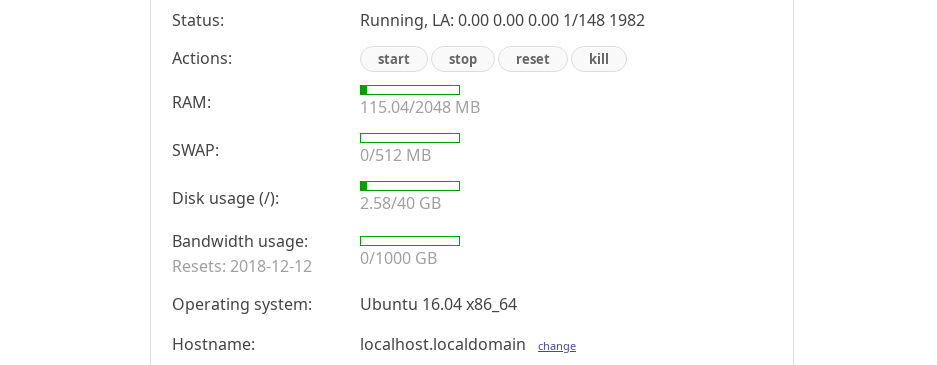
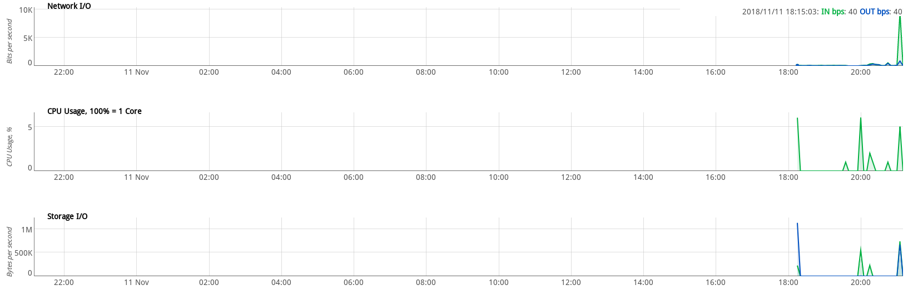
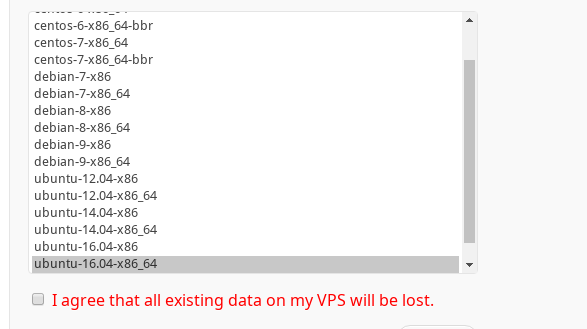
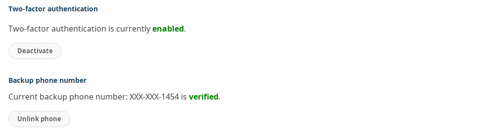
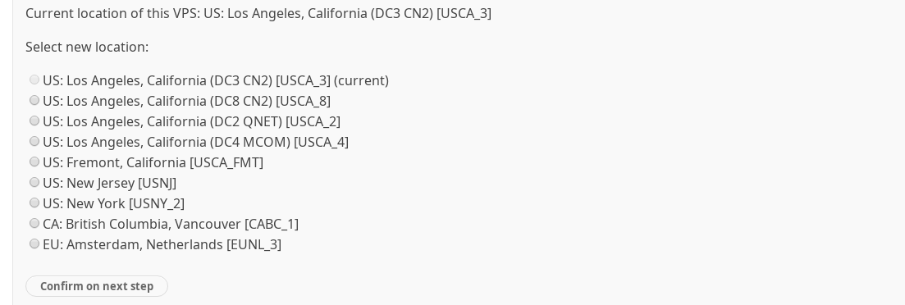

# 搬瓦工VPS建站指南

> 本地用的Arch Linux，搬瓦工安装的Ubuntu 18

本指南的目的，并非仅仅是含糊地介绍如何快速建站。而是通过每一步详细的讲解，提高Linux的技能水平，在以后的操作中得心应手。

## 建站基础#1 KiwiVM基本配置

服务器购买完毕后，进入 `Client Area -> Services-> My Services` 便能看见服务器列表：  

  

查看服务器状态、重装系统、二次验证、修改root密码等操作都是在KiwiVM中进行的。  

### Main controls 系统状态监控

这里能看到系统内存和交换区的占用、IP地址、SSH端口、运行状态、硬盘容量等信息。并且可以执行关机，开机等操作。  

  

### Detailed statistics 状态详情

这里以图表的方式展现网络状态、CPU占用情况、储存I/O状态。  

  

### 网页版终端操作

`Root shell -basic` 和 `Root shell -advanced` 和 `Root shell -interactive` 都是用来执行命令行的，但一般不使用，都是用OpenSSH或者SSH GUI客户端。  

### Install new OS更换系统

搬瓦工提供了丰富的OS选择，推荐安装 Ubuntu-18.04 ，因为它拥有4.15新内核，可直接开启Google BBR。  

  

### Two-factor authentication 二次验证

每当进入KiwiVM时，可以设置输入二次验证码，这里支持 `Google身份验证` 和手机短信验证。  

  

### Root password modification ROOT密码修改

改root密码前，需要在Main Controls中stop服务器。并且只能生成随机密码。  

### KiwiVM password modification KiwiVM登录密码修改

这里可以随意修改KiwiVM登录密码。

### Migration 数据迁移

通过 `Migrate to another DC` 可以切换主机的地址和IP，前提是IP未被GFW查封。  

  

### Snapshots 建立/导入快照

快照可以对当前的VPS进行全拷贝，可用于遇到突发情况时，快速恢复备份。快照只会存储30天，30天之后自动被删除。当然还有一种名叫胶水快照(Sticky snapshots)的服务，这样的快照不会被自动删除，但每个服务器仅能拥有2个胶水快照。


## 建站基础#2 系统初始化

### 初始更新

系统安装完毕后，进入KiwiVM的网页版终端，执行 `apt-get update` 和 `apt-get upgrade` 更新一下系统文件和下载源。  

### 新增普通用户

root用户的潜在危害极大，需要使用 ` adduser` 新增普通用户进行权限限制。  

```bash
root@ubuntu:~# adduser cloudsen
Adding user `cloudsen' ...
Adding new group `cloudsen' (1000) ...
Adding new user `cloudsen' (1000) with group `cloudsen' ...
Creating home directory `/home/cloudsen' ...
Copying files from `/etc/skel' ...
Enter new UNIX password: 
Retype new UNIX password: 
passwd: password updated successfully
Changing the user information for cloudsen
Enter the new value, or press ENTER for the default
        Full Name []: CloudSen
        Room Number []: 42
        Work Phone []: 7355608
        Home Phone []: 
        Other []: 
Is the information correct? [Y/n] y

root@ubuntu:~# cd /home
root@ubuntu:/home# ls
cloudsen
```

使用 `adduser` 后，设置了密码，分配了组和用户目录等信息。日常可以使用该用户登录系统。  

### 推荐安装工具

以下是一些实用的服务器端软件工具：

- VIM - 文本编辑器
- htop - 系统资源监控软件
- curl - cURL是一个利用URL语法在命令行下工作的文件传输工具
- git - 版本控制工具
- zsh - 替代bash
- oh-my-zsh - 方便又强大的zsh设置，提供很多便捷操作


## 建站基础#3 SSH

> 本节参考资料：
>
> - [Arch Linux Wiki - SSH](https://wiki.archlinux.org/index.php/Secure_Shell_(%E7%AE%80%E4%BD%93%E4%B8%AD%E6%96%87))
> - [Arch Linux Wiki - SSH keys](https://wiki.archlinux.org/index.php/SSH_keys_(%E7%AE%80%E4%BD%93%E4%B8%AD%E6%96%87)#.E9.80.89.E6.8B.A9.E5.90.88.E9.80.82.E7.9A.84.E5.8A.A0.E5.AF.86.E6.96.B9.E5.BC.8F)
>
> 本节参考博文：
>
> > 作者：Hanif Jetha
> >
> > 连接：[How to set up SSH keys](https://www.digitalocean.com/community/tutorials/how-to-set-up-ssh-keys-on-ubuntu-1604)
> >
> > 发布于：digitalocean
>
> > 作者：rabexc
> >
> > 连接：[using ssh agent](http://rabexc.org/posts/using-ssh-agent)
> >
> > 发布于：rabexc.org
>
> > 作者：EdCates
> >
> > 连接：[ssh-agent under Plasma 5](https://bbs.archlinux.org/viewtopic.php?id=193311)
> >
> > 发布于：Arch Wiki

### 通过SSH连接服务器

#### 安装OpenSSH

在本地Arch上安装OpenSSH，远程Ubuntu已经自带了：  

```bash
yay -S openssh
```

这里提一下SSH的几个路径和配置文件：  

- `~/.ssh/` 当前用户域下的.ssh文件夹存放的是该用户的ssh配置和密匙
- `~/.ssh/config` 配置连接会话信息，用于分类管理和便捷操作 
- `~/.ssh/id_rsa 和 ~/.ssh/id_rsa.pub` 默认的公匙私匙文件名
- `~/.ssh/known_hosts` 存放连接过的服务器的公钥指纹
- `/etc/ssh/sshd_config` 系统的sshd服务配置，sshd服务使用SSH协议来进行远程控制，它针对SSH服务端
- `/etc/ssh/ssh_config` 系统针对SSH客户端的配置

#### 以密码方式连接

连接远程服务器：  

```bash
ssh -p <远程ssh端口> <用户名>@<远程IP地址>
```

输入远程服务器的用户密码即可连接，连接后会保存一个 `SHA256 ECDSA key fingerprint` ，保存路径是 ` ~/.ssh/known_hosts` 。  

将服务器信息写入 `~/.ssh/config` 配置，更方便地去连接：  

```
Host blogvps
    HostName <远程IP地址>
    Port     <远程SSH端口>
    User     <远程用户名>
```

这样一来，直接输入 `ssh blogvps` 然后输入密码，就能连接服务器了。  

#### 以密匙方式连接

 `密匙对` 使用非对称加密，提供了一个更简单、安全的方式去连接服务器，被连接的一方保存公匙，连接的一方保存私匙。  

大概的登录流程，简单来说是这样的：  

- 远程服务器发现有用户登录时，通过 `公匙` 生成字符串，`加密` 后发送给用户
- 用户收到字符串后，通过 `私匙` 对字符串 `解密` ，然后返回给远程服务器
- 远程服务器进行判断，若返回的字符串与自己生成的相同，则认证成功，反之认证失败

现在我们要连接远程服务器，那么就要把公匙发过去，自己保留私匙。同理GIT HUB也支持SSH方式连接，GIT HUB保留的也是公匙。  

##### 生成密匙

现在我使用本地Arch Linux生成SSH私匙和公匙，执行 `ssh-keygen` 得到以下输出：  

```bash
ssh-keygen

Generating public/private rsa key pair.
Enter file in which to save the key (/home/cloudsen/.ssh/id_rsa): 
Enter passphrase (empty for no passphrase): 
Enter same passphrase again: 
Your identification has been saved in /home/cloudsen/.ssh/id_rsa.
Your public key has been saved in /home/cloudsen/.ssh/id_rsa.pub.
The key fingerprint is:
SHA256:dhtaQtxvvBglwo0hgACMIIj2+2xdRfLt4/R3HYpI9Oc cloudsen@GLaDOS
The key's randomart image is:
+---[RSA 2048]----+
|%. .... .        |
|=o.    + * .     |
|.       * B o    |
|   .   . o B .   |
|    .   S B =    |
|   .   . B B * . |
|    o . + + B + o|
|     + .   . E .+|
|                o|
+----[SHA256]-----+


cd .ssh 
ls
>> config  id_rsa  id_rsa.pub  known_hosts
```

`ssh-keygen` 默认是生成 `SHA256` 长度为2048-bit的RSA密匙，平常来说够用了。**我们可以自定义密匙的保存路径和文件名**，默认私匙的保存路径是 `/<用户>/.ssh/id_rsa` ，公匙的保存路径是 `/<用户>/.ssh/id_rsa.pub` 。生成的过程中请务必输入 `passphrase密码短语` 获得更安全的保障。  

> 务必确保公匙和私匙的权限是正确的，id_rsa是600，id_rsa.pub是644

##### 将公匙发送给远程服务器

方式有很多种，这里介绍最方便的，使用 `ssh-copy-id` 直接将本地的 `id_rsa.pub` 复制到远程服务器的 `/root/.ssh/authorized_keys` 文件中。为什么远程服务器上公匙要重命名？不急，下面会提到。执行以下指令：  

```bash
# 发送默认的公匙id_rsa.pub
ssh-copy-id -p <远程SSH端口> <用户名>@<远程IP>
# 发送指定的公匙
ssh-copy-id -i <公匙路径> -p <远程SSH端口> <用户名>@<远程IP>
```

输出信息如下：  

```bash
/usr/bin/ssh-copy-id: INFO: Source of key(s) to be installed: "/home/cloudsen/.ssh/id_rsa.pub"
/usr/bin/ssh-copy-id: INFO: attempting to log in with the new key(s), to filter out any that are already installed
/usr/bin/ssh-copy-id: INFO: 1 key(s) remain to be installed -- if you are prompted now it is to install the new keys
root@xxx.xxx.xx.xxx's password: 
Number of key(s) added: 1
Now try logging into the machine, with:   "ssh -p 'xxxx' 'root@xxx.xxx.xx.xxx'"
and check to make sure that only the key(s) you wanted were added.
```

然后检查远程服务器中是否收到名叫 `authorized_keys` 权限为 `rw` 的公匙：  

```bash
root@ubuntu:~/.ssh# ls -la
total 20
drwx------ 2 root root 4096 Nov 11 10:04 .
drwx------ 6 root root 4096 Nov 11 10:09 ..
-rw------- 1 root root  397 Nov 11 10:04 authorized_keys
-rw------- 1 root root 1766 Nov 11 09:15 id_rsa
-rw-r--r-- 1 root root  393 Nov 11 09:15 id_rsa.pub
```

##### 使用密匙连接

 打开 `/etc/ssh/sshd_config` 文件，去掉以下配置的注释：  

```
PubkeyAuthentication yes
```

再次连接我们的远程服务器，看到提示信息变成了：  

```bash
ssh blogvps
Enter passphrase for key '/home/cloudsen/.ssh/id_rsa':
```

这里输入刚刚设置的**私匙密码短语**，就能连接了，不用再输入搬瓦工自动生成的复杂密码了~！若之前生成密匙的时候，没有输入密码短语，这一步就跳过，直接连接成功。  

等等，为什么远程端的公匙要命名为authorized_keys呢？在 `/etc/ssh/sshd_config`中可以看到：  

```
# Expect .ssh/authorized_keys2 to be disregarded by default in future.
#AuthorizedKeysFile     .ssh/authorized_keys .ssh/authorized_keys2
```

配置中指定的文件名默认是authorized_keys，它存放了所有认证的公匙信息和用户信息，若以后还要添加其他公匙，就在这个文件里面追加。  

### 增加SSH的安全

#### 之前的做法有什么问题？

经过以上的设置，我们能够使用自己的电脑，通过SSH，以密码或者密匙的方式，来远程连接服务器，并登录ROOT用户。读这句话的时候，有几点不太合理：  

1. 现在只能进行一对一的连接，如果有多个用户连接远程服务器，公匙怎么存放才合理呢？
2. 如果本地有很多不同的私匙，怎么指定远程认证用哪个私匙呢？？
3. 密码登录不安全，可以被暴力破解，要禁止，应该只允许密匙认证；
4. ROOT用户权限太大，极其不安全，应该禁止SSH登录ROOT用户；

#### 如何解决

##### 将公匙发送到远程服务器的普通用户目录下

> 这一步有多少人管理服务器，就重复多少次。
>
> 例如两个人管理服务器，那么服务器上应该创建两个普通用户，
>
> 每个人分别在自己电脑上生成自己的公匙和密匙，
>
> 然后再分别上传公匙到自己的远程普通用户目录下。

现在开始所有的SSH只允许普通用户连接，修改本地 `~/.ssh/config`：  

```
# root用户的配置
Host blogvps-root
    HostName <远程IP地址>
    Port     <远程SSH端口>
    User     root

# 新增你自己的普通用户配置
Host blogvps-cloudsen
    HostName <远程IP地址>
    Port     <远程SSH端口>
    User     cloudsen
```

将公匙发送到服务器普通用户的目录中：  

```bash
ssh-copy-id -p <远程SSH端口> <普通用户名>@<远程IP>
```

成功后远程登录该用户，查看 `~/.ssh/` 下是否有 `authorized_keys` ：  

```bash
# 本地
ssh blogvps-cloudsen
Enter passphrase for key '/home/cloudsen/.ssh/id_rsa': xxxx

# 服务器
cloudsen@ubuntu:~$ cd .ssh/
cloudsen@ubuntu:~/.ssh$ ls -la
total 20
drwx------ 2 cloudsen cloudsen 4096 Nov 11 14:27 .
drwxr-xr-x 4 cloudsen cloudsen 4096 Nov 11 11:58 ..
-rw------- 1 cloudsen cloudsen  397 Nov 11 14:27 authorized_keys <<<<<<
-rw------- 1 cloudsen cloudsen 1766 Nov 11 11:58 id_rsa
-rw-r--r-- 1 cloudsen cloudsen  397 Nov 11 11:58 id_rsa.pub
```

若你需要在不同的设备上远程连接，那么在每个设备上都执行一次以上操作，服务器上的 `authorized_keys` 文件会记录所有认证的公匙信息。

##### 服务器配置禁止ROOT用户远程登录，禁止密码登录

> 因为还用不到自动化运维，所以直接禁止ROOT远程登录，更好的做法是限制ROOT登录。

远程登录到root用户，然后修改系统 `/etc/ssh/sshd_config` 的配置： 

```
# 禁止密码登录，强制公钥验证
PasswordAuthentication	no
# 禁止ROOT登录
PermitRootLogin no
```

保存后，执行 `service sshd restart` 重启sshd服务，然后退出登录，再用SSH登录ROOT，会提示 `Permission denied` 。  

若以后又来了新人管理服务器，那么他首次只能以密码方式登录，这个时候依然提示 `Permission denied` 。此时需要使用root权限，修改sshd_config配置，恢复允许密码登录，然后等新人将自己的公匙放到自己的普通用户目录下后，再禁止密码登录。  

##### 为不同的远程连接指定不同的私匙认证

为了安全和可维护性，我们应该为不同的远程服务创建不同的密匙对，`~/.ssh/config` 就是用来管理SSH会话的。比如现在我要以SSH的方式使用阿里云的服务器，那就要重新生成一对名叫 `id_rsa_ali` 的密匙：  

```bash
ssh-keygen

Generating public/private rsa key pair.
Enter file in which to save the key (/home/cloudsen/.ssh/id_rsa): /home/cloudsen/.ssh/id_rsa_ali          <<<<<<<<<<<<<<<
Enter passphrase (empty for no passphrase): 
Enter same passphrase again: 
Your identification has been saved in /home/cloudsen/.ssh/id_rsa_ali.
Your public key has been saved in /home/cloudsen/.ssh/id_rsa_ali.pub.
The key fingerprint is:
SHA256:qmyIULqfkmh7yjEHJ/FDTXIxV3LGg1VwCm5REYZqiaE cloudsen@GLaDOS
The key's randomart image is:
+---[RSA 2048]----+
|.**.o            |
+----[SHA256]-----+

cd .ssh/
ls -la

-rw-r--r--  1 cloudsen cloudsen  228 11月 12 01:47 config
-rw-------  1 cloudsen cloudsen 1876 11月 11 22:41 id_rsa
-rw-------  1 cloudsen cloudsen 1876 11月 12 04:07 id_rsa_ali
-rw-r--r--  1 cloudsen cloudsen  397 11月 12 04:07 id_rsa_ali.pub
-rw-r--r--  1 cloudsen cloudsen  397 11月 11 22:41 id_rsa.pub
-rw-r--r--  1 cloudsen cloudsen  184 11月 11 21:44 known_hosts
```

现在就有两对密匙了，一对是给搬瓦工服务器用，一对是给阿里云服务器用，修改 `~/.ssh/config` ，通过 `IdentifyFile` 来指定私匙：  

```
# 搬瓦工普通用户配置
Host blogvps-cloudsen
    HostName <远程IP地址>
    Port     <远程SSH端口>
    User     cloudsen
    IdentityFile  ~/.ssh/id_rsa
    
# 阿里云普通用户配置
Host ali-cloudsen
    HostName <远程IP地址>
    Port     <远程SSH端口>
    User     cloudsen
    IdentityFile  ~/.ssh/id_rsa_ali
```

然后把公匙分别放到不同的远程服务器上，这样就实现了本地用不同的密匙认证不同的SSH连接。 

##### 更加安全的配置

目前只是个人服务器，没有必要做过于复杂的安全设置，自行扩展吧：  

- 私匙加入 [Google Authenticator](https://wiki.archlinux.org/index.php/Google_Authenticator)来进行二次认证
- 保证服务器 authorized_keys 文件的安全，将authorized_keys的权限设置为对拥有者只读，其他用户没有任何权限

### SSH agent的使用

#### SSH代理的作用

`ssh-agent` 是OpenSSH自带的用于提高效率和安全性的工具，大致的功能如下：

1. 免去每次都要输入私匙密码短语的烦恼
2. 免去在 `~/.ssh/config ` 中配置每个远程服务对应的私匙
3. 可将私匙应用于 `git` 、`rsync` 、`scp` 等服务
4. 代理转发ForwardAgent【非常棒的功能】  

#### SSH 代理的基本用法

##### 运行agent

```bash
# 创建子shell，在子shell中运行agent进程
$ eval 'ssh-agent'
# 单独启动一个agent进程
$ ssh-agent $SHELL
# 或者在.bashrc中加入
if [ -z "$SSH_AUTH_SOCK" ] ; then
    eval `ssh-agent`
    ssh-add
fi
```

##### 添加私匙到代理

```bash
# 永久代理
ssh-add ~/.ssh/<你的私匙>
# 定时代理，超时后不再代理
ssh-add -t <秒数> ~/.ssh/<你的私匙>
```

##### 查看当前代理中已存在的密匙

```bash
# 查看代理中的私匙
ssh-add -l
# 查看代理中的私匙对应的公匙
ssh-add -L
```

##### 删除已代理的私匙

```
ssh-add -d ~/.ssh/<你的私匙>
# 删除全部
ssh-add -D
```

##### 关闭agent

```bash
ssh-agent -k
```

 

注意，这样手动操作都是有问题的，每次都会产生一个 `ssh-agent` 实例，并在会话期间一直运行，若忘记关闭，不久之后，你的系统中就会有多个根本不再需要的 `ssh-agent` 进程在运行，只有重启后它们才会关闭。  

如今，很多Linux发行版，当你登录的时候，就会启动一个系统控制的ssh-agent，直接用它就好，不需要再开启新的agent，直接使用 `ssh-add` 就好。

以下是针对KDE5的额外内容，KDE5没有自动启动一个可用的ssh-agent，需要进行以下设置。  

新建~/.config/plasma-workspace/env/ssh-agent-startup.sh：

```
#!/bin/sh
[ -n "$SSH_AGENT_PID" ] || eval "$(ssh-agent -s)"
```

新建 ~/.config/plasma-workspace/shutdown/ssh-agent-shutdown.sh：

```
#!/bin/sh
[ -z "$SSH_AGENT_PID" ] || eval "$(ssh-agent -k)"
```

这样设置后，就不用手动启动agent进程了。  

#### SSH 代理的应用

##### 思考1

本地电脑A，远程服务器B，还有一个网关(gateway)服务器C，若A不能连接到B，需要先连接到C，然后才能连接到B，并且整个连接过程只允许密匙的方式。  

因为A最终与B和C都建立了连接，那么就需要把A的公匙发送到B和C的authorized_keys中。然后A通过SSH keys连接到B，这一步没问题。现在再从B连接到C，这一步就出问题了，因为B上没有A的私匙，无法和C中的公匙进行认证，导致连接失败。怎么办呢？难道要把A的私匙发一份给B吗？NO！这样是极其危险的做法，我们一定要记得，**私匙只能由我们自己保管**。  

##### 思考2

我们在使用 `git` ，`rsync` 这些工具的时候，也需要用到SSH，那怎么让git知道我们的密匙呢？  

##### 使用代理转发解决多个服务器之间的认证

添加私匙到代理，添加时需输入当前私匙的密码短语：  

```bash
# 设置私匙代理生命周期为3小时，3小时后删除代理中的该私匙，偷懒的话就不要加-t参数，永久代理。
$ ssh-add -t 10800 ~/.ssh/id_rsa
Enter passphrase for /home/cloudsen/.ssh/id_rsa: 
Identity added: /home/cloudsen/.ssh/id_rsa (cloudsen@GLaDOS)
Lifetime set to 10800 seconds
```

代理私匙后，我们不再需要在 `~/.ssh/config` 中指定IdentifyFile了，**代理会根据公匙自动选择对应的私匙**，在连接时也不需要输入私匙密码短语，非常方便。  

然后再配置**每台电脑的** `~/.ssh/config` ，让SSH客户端支持代理转发，加入以下配置：  

```
Host *
    ForwardAgent yes
```

测试一下 `ssh blogvps-cloudsen` 直接就连上服务器了。然后再连接到另外一台服务器也不需要输入任何信息，agent已经转发我们的私匙代理，可以直接在远程服务器认证本地电脑的私匙。

##### github使用SSH agent

github默认使用HTTPS的方式托管代码，这种方式每次push都要输入用户和密码，若要记住密码则在git全局变量中加入以下配置:  

```
git config --global credential.helper store
```

将生成的github公匙，复制到github[设置页面](https://github.com/settings/keys)上：  

```bash
ssh-keygen
cat .ssh/id_rsa_github.pub
```

然后将github的私匙给agent代理：  

```bash
ssh-add ~/.ssh/id_rsa_github
```

然后测试是否能连接github：  

```bash
ssh -T git@github.com
Warning: Permanently added the RSA host key for IP address '13.229.188.59' to the list of known hosts.
Hi CloudSen! You've successfully authenticated, but GitHub does not provide shell access.
```

若出现你的github用户名，说明可以使用SSH PULL PUSH代码了！  

最后修改已存在git项目的url：  

```bash
git remote set-url origin git@github.com:<github用户名>/<项目名>.git
```

### Android连接VPS

> 如果购买了JuiceSSH高级版，则不用手动发公匙，app在连接的时候可以直接发公匙

1. 去Google Play下载 `JuiceSSH` ；

2. 打开JuiceSSH，新建认证；

3. 生成 `私匙` ；

4. 在认证列表长按刚刚新建的认证，到处公匙到 `Dropbox`；

5. 在本地电脑将手机的公匙上传到VPS服务器的 `~/.ssh/authorized_keys` 文件中：  

    ```bash
    # -i指定公匙
    ssh-copy-id -i ~/Dropbox/id_rsa_oneplus3.pub -p 29950 <普通用户名>@<远程IP>
    ```

6. 最后连接的时候选择SSH认证就好了。

