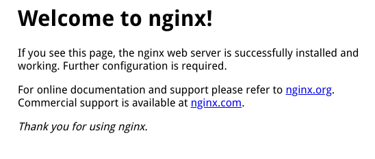

# Nginx指南#1安装与基础功能

> 工欲善其事，必先利其器。
>
> 本篇基于Arch Linux。


## 安装

### 通过源进行安装

很简单 `yay nginx` or `sudo pacman -S nginx`

### 通过源码编译进行安装

待续。。。  


## 基础功能

### 在运行时控制Nginx进程

#### Master和Works

Nginx刚开始启动的时候，会有一个 `master` 进程，多个 `worker` 进程，如果 `caching` 启用的话，还会有 `cache loader` 进程和 `cache manager` 进程。  

在运行的过程中，master会读取配置文件，并管理workers。  

各种request请求是交给workers来处理的。Nginx依赖操作系统的机制，高效地在works中分发request。

`nginx.conf` 配置文件中存放的就是各种指令（`directive`）和上下文(`context`)。works的数量就是通过 `worker_processes` 这个directive来配置的，它可以设置为固定的数量，也可以设置自动调整为CPU可用核心数。  


#### 控制Nginx

以下是 `nginx` 指令参数说明：

```bash
nginx -h
Usage: nginx [-?hvVtTq] [-s signal] [-c filename] [-p prefix] [-g directives]
Options:
  -?,-h         : 打开帮助
  -v            : 显示nginx版本并退出
  -V            : 显示nginx版本和配置选项并退出
  -t            : 测试配置文件并退出
  -T            : 测试配置文件，转储后退出
  -q            : 测试配置文件过程中不显示非错误信息
  -s signal     : 给master进程发送信号: stop, quit, reopen, reload
  -p prefix     : 设置前缀路径 (默认: /etc/nginx/)
  -c filename   : 以指定的配置文件运行 (默认: /etc/nginx/nginx.conf)
  -g directives : 设置未包含在配置文件中的全局指令
```

可以通过停止或重启Nginx，或向master进程发信号的方式来重新加载配置。通过nginx指令的 `-s` 参数来发送一个信号。  

```bash
nginx -s <SIGNAL>
```

信号类型如下：

- quit - 优雅地关闭
- reload - 重新加载配置文件
- reopen - 重新打开日志文件
- stop - 立即强制关闭

Linux的 `kill` 指令也可以直接给master发送信号。默认情况下，master的进程ID被写入 `nginx.pid` 文件中，该文件路径为 `/usr/local/nginx/logs` 或 `/var/run` (Arch Linux)。  


### 配置文件

Nginx Plus默认的配置文件存放在 `/etc/nginx/nginx.conf` 。Nginx Open Source的配置文件存放在 `/usr/local/nginx/conf` 或 `/etc/nginx` (Arch Linux) 或 `/usr/local/etc/nginx` 。  

##### Directives指令

配置文件由指令和它的参数构成。简单的指令是单行的，并以分号结束。其他的指令可以借助 `{}` ，以容器的形式去包含相关的指令，这被称为块（blocks）。如以下简单指令：  

```
user    nobody;
error_log    logs/error.log notice;
worker_processes    1;
```

##### 更好地管理配置文件

为了使配置文件便于维护，建议将指令根据特定的功能，分离到不同的文件中，并将这些文件存放到 `/etc/nginx/conf.d` 目录下进行统一管理。然后在主配置文件 `nginx.conf` 中使用 `include` 指令来引入需要的配置文件。  

```
include conf.d/http;
include conf.d/stream;
include conf.d/exchange-enhanced;
```

##### Context上下文

这些顶层的指令被称作 `上下文` ，它们将不同流类型（traffic types）的指令组合在一起。  

```
events - 处理一般连接
http - HTTP流
mail - Mail流
stream - TCP/UDP流
```

在这些上下文外的指令，称作在 `主上下文` 中。  

##### 继承

一般而言，一个被包含在其他上下文中的子上下文，会继承父类的设置。有些指令能够出现在不同的上下文中，在这中情况下，子上下文可以重新设置该指令，从而覆盖父类的设置。

##### Virtual Servers虚拟服务

在每个流处理上下文中，可以包含一个或多个 `server` 块，这些服务块就是虚拟服务，它控制请求的处理。在 `server` 块中能包含的指令是根据流类型而变化的。  

对于 `http` 上下文来说，每个 `server` 指令都控制特定域或IP地址的资源请求。在 `server` 中的一个或多个 `location` 定义了如何处理特定的URLs集。  

对于 `mail` 和  `stream` 上下文来说，每个 `server` 指令控制到达特定TCP端口或UNIX socket的流处理。  

```
user nobody; # 在主上下文中的指令 simple directive

events { # context directive
    # 处理连接的配置
}

http { # context directive
    # http的特定配置，这里的配置影响包含在其中的所有server 

    server { # context directive
        # http虚拟服务1的配置     
        listen *:80; #simple directive
        location /one { # context directive
            # 配置开始于 '/one'的url的处理
        }
        location /two { # context directive
            # 配置开始于 '/two'的url的处理
        }
    } 
    
    server { # context directive
        # http虚拟服务2的配置    
    }
}

stream { # context directive
    # TCP/UDP的特定配置，这里的配置影响包含在其中的所有server 
    server { # context directive
        # TCP虚拟服务1的配置 
    }
}
```

  

## 启动Nginx测试

> Arch Linux 执行 `sudo nginx -t` 时，会有警告提示：
>
> could not build optimal types_hash, you should increase either types_hash_max_size: 1024 or types_hash_bucket_size: 64; ignoring types_hash_bucket_size
>
> 需要在http上下文中加入：
>
> ```
> types_hash_max_size 4096;
> server_names_hash_bucket_size 128;
> ```

以默认初始配置启动Nginx：

```bash
# 这里执行完毕没有任何提示
sudo nginx
# 若有master PID则说明nginx已经在运行了
cat /var/run/nginx.pid

```

然后测试一下效果：

```bash
curl -I 127.0.0.1
# 返回信息说明成功
HTTP/1.1 200 OK
Server: nginx/1.14.0
Date: Fri, 09 Nov 2018 19:31:05 GMT
Content-Type: text/html
Content-Length: 612
Last-Modified: Fri, 20 Apr 2018 09:18:34 GMT
Connection: keep-alive
ETag: "5ad9b06a-264"
Accept-Ranges: bytes
```

或访问 `127.0.0.1:80` ：

  

到此，说明Nginx已经安装成功，并了解 `nginx` 的配置文件和简单用法。  

  


> 版权信息
>
> 本文基于官方文档，本人进行了翻译和归纳总结，原作者信息如下：
>
> > 作者：NGINX
> >
> > 链接：[Basic Functionality](https://docs.nginx.com/nginx/admin-guide/basic-functionality/runtime-control/)
> >
> > 发布于：NGINX
>