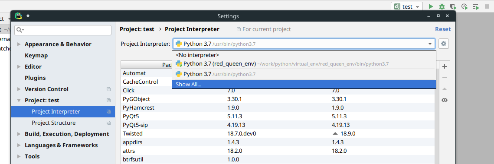
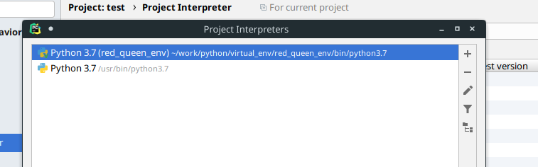
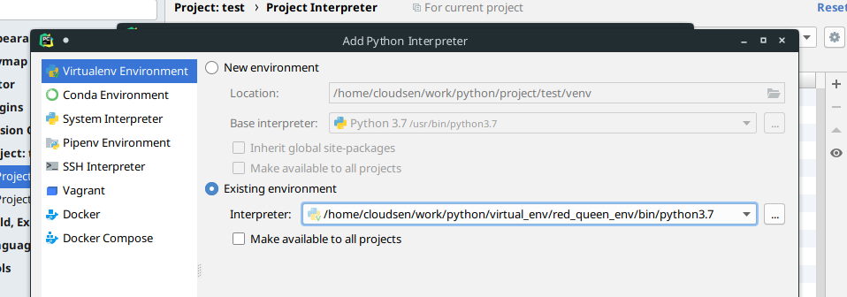
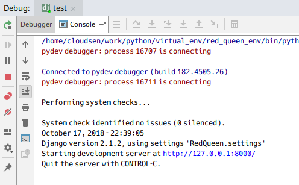

# Tutorial 指南

## 环境搭建

### 终端方式

1. 安装好Python与虚拟环境相关包：

   见 Python安装指南。

2. 使用Git将项目克隆到指定路径；

3. 使用virtualenvwrapper在虚拟环境中安装相关依赖：

   ```bash
   # 创建完毕会自动激活当前虚拟环境
   mkvirtualenv red_queen_env
   # 安装项目所需的依赖
   pip install -r <项目路径>/requirements.txt
   ```

4. 然后启动项目进行测试

   ```bash
   cd <项目路径>
   python manage.py runserver
   ```


### Pycharm方式

1. Pycharm Linux安装；

2. 若已经clone了项目，则直接 `Open` 即可；

3. 若还没有clone项目：

   - 选择 `Check out from Version Control` > `Git` ；

   - 填入 `github` 项目的 `URL` 和本地存放路径 `Directory` ，点击 `clone`；

   - 打开项目后，此时是不能使用的，因为没有指定虚拟环境：

     - 进入 `Settings` 找到当前项目，点击 `Show All...`

         

     - 点击 `+` 新增一个项目解析器

         

     - 新建一个虚拟环境或者指定一个已存在的虚拟环境

         

     - 确认后，即可启动项目

         

         
