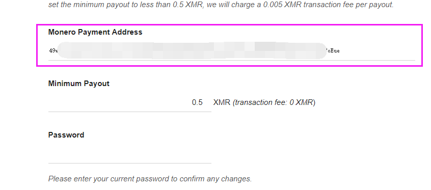
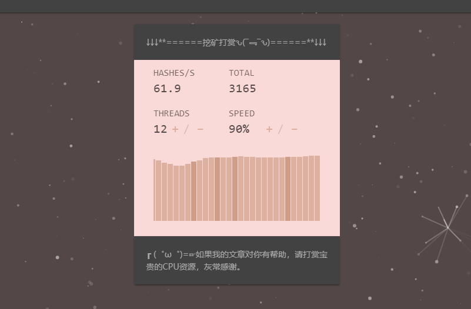

## 前言

> 注意：本网站不会自动开启此脚本，一切都是自愿噢~
>
> 别说了，赶紧拿着N个手机和笔记本跑去公司开着挖币吧，免费电力[]~(￣▽￣)~*

最近发现可以通过 `JavaScript` 使用CPU挖门罗币，挺好玩的，记录下将 `Coinhive Mining Tool` 部署到网站的过程。部署之后，手机和电脑打开网页即可挖矿，还能根据计算数值测试设备性能。

## 注册门罗币钱包

去门 [罗币官网 ](https://getmonero.org/downloads/)下载所需软件，加压后打开 `monero-wallet-gui.exe` 跟着流程注册。  

> 该软件可以在电脑上挖矿，但是需要同步区块链，比较耗时，这里只拿钱包地址就行了！

需要填入节点时，选择远程节点，地址填入 `monero.opennumber.org` ，端口填入 `18089` 。进入GUI界面后，打开 `收款` 即可获得钱包地址。

## 注册挖矿平台

去 [Coinhive官网](https://coinhive.com) 注册一个账号，注册完毕后，进入 `Settings->Payments` 然后在 `Monero Payment Address` 这一栏填入上一步得到的钱包地址。  

  

然后进入 `Settings->Sites & API Keys` ，得到 `Site Key(public)` ，这个一会要填入html中。

##  用法一：简易UI界面

> 详细的官方文档见 [JavaScript Miner](https://coinhive.com/documentation/miner)。
>
> 这里推荐使用 [Authed Mine](https://coinhive.com/documentation/authedmine)，因为它是Non-Adblocked Miner，避免被广告拦截器过滤。
>
> WIN10系统自带的Defender会将Miner JS识别为病毒，需要手动忽略。

官方提供了 `Simple Miner UI` 无脑开箱使用，首先在 [这里](https://authedmine.com/lib/simple-ui.min.js) 下载 `simple-ui.min.js` 。然后将JS文件放入博客项目中。  

接下来进行引入JS文件：  

```javascript
<script>
    let onCoinHiveSimpleUIReady = function () {
        CoinHive.Miner.on('authed', function (params) {
            console.debug('Simple UI has authed with the pool...')
        })
        CoinHive.Miner.on('job', function (params) {
            console.debug('New job received from pool...')
        })
    }
</script>
<script src="" async></script>
```

然后加入HTML布局：

> 我这里使用的 `BootStrap 4 for Material Design` UI框架。

```html
<div class="container">
        <div class="row">
            <div class="col-sm-12 col-md-4 col-lg-4 offset-md-4 offset-lg-4">
                <div class="card bg-dark text-gray">
                    <div class="card-body">
                        ↓↓↓**======挖矿打赏ԅ(¯﹃¯ԅ)======**↓↓↓
                    </div>
                </div>
            </div>
        </div>
        <div class="row">
            <div class="col-sm-12 col-md-4 col-lg-4 offset-md-4 offset-lg-4">
                <!-- 就是加入它 start -->
                <!-- 注意使用自己的key -->
                <div class="coinhive-miner"
                     data-key="ncDPzHM1X7Y8lO7IyyGHZthdy3KG9kqn"
                     data-autostart="true"
                     data-whitelabel="true"
                     data-background="#FADAD8"
                     data-text="#534847"
                     data-action="#D09E88"
                     data-graph="#D09E88"
                     data-threads="4"
                     data-throttle="0.4">
                    <em>矿机载入中...</em>
                </div>
                <!-- 就是加入它 end -->
            </div>
        </div>
        <div class="row">
            <div class="col-sm-12 col-md-4 col-lg-4 offset-md-4 offset-lg-4">
                <div class="card bg-dark text-gray">
                    <div class="card-body">
                        ┏ (゜ω゜)=☞如果我的文章对你有帮助，请打赏宝贵的CPU资源，灰常感谢。
                    </div>
                </div>
            </div>
        </div>
```

| 属性            | 作用                                                         |
| --------------- | :----------------------------------------------------------- |
| data-key        | 填入Coinhive官网的网站公匙。                                 |
| data-autostart  | 第一次加载时，都不会自动开始。直到用户点击开始后，刷新页面就能自动开始。 |
| data-whitelabel | 是否隐藏“Powered by Coinhive”                                |
| data-background | 背景颜色                                                     |
| data-text       | 面板文字颜色                                                 |
| data-action     | 按钮及其文字颜色                                             |
| data-graph      | 条形图                                                       |
| data-threads    | 起始线程数                                                   |
| data-throttle   | 线程应该空闲的时间，0为全速，0.5表示线程将在50％的时间内保持空闲状态。 |

最后调节一下CSS：

```css
html, body {
    background: #534847;
}

.coinhive-miner {
    width: 100%;
    height: 300px;
    border: none;
}
```

刷新界面即可使用：

  

在coinhive官网也可以看到详细数据：

  

## 结语

JS挖矿的方式还有几种，后面慢慢更新，希望各位大大多多打赏CPU。

